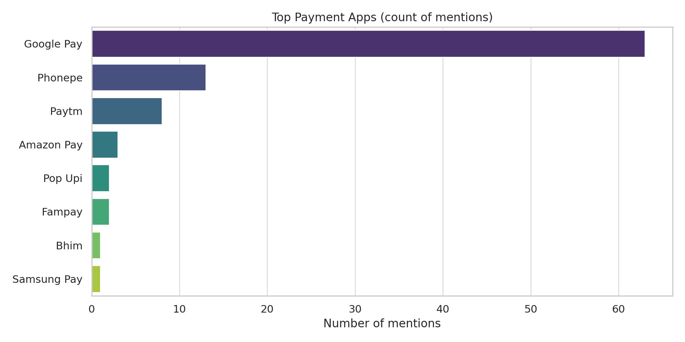
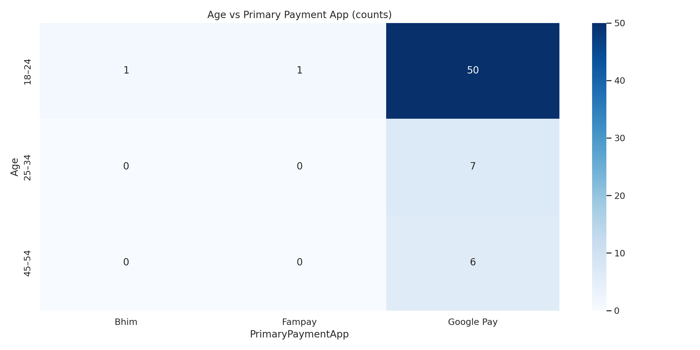
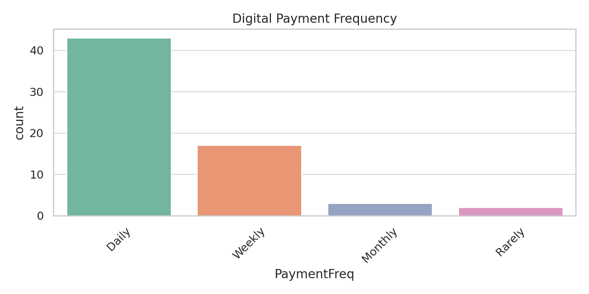
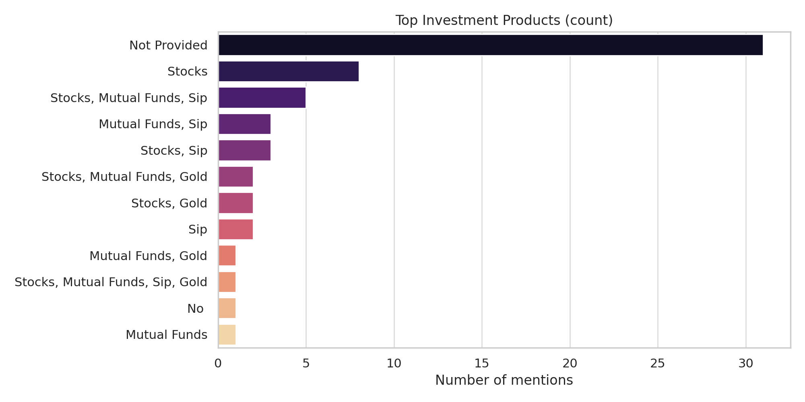
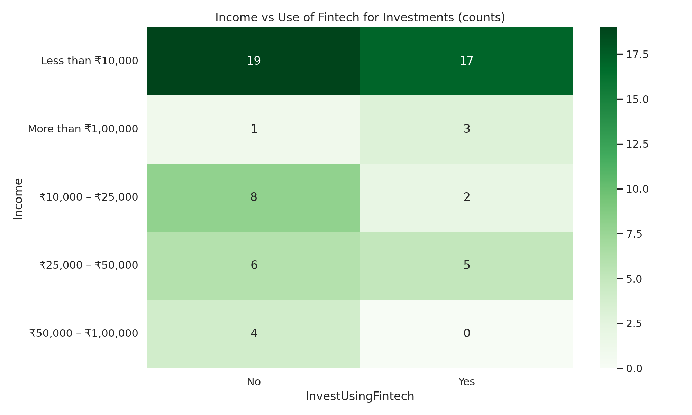
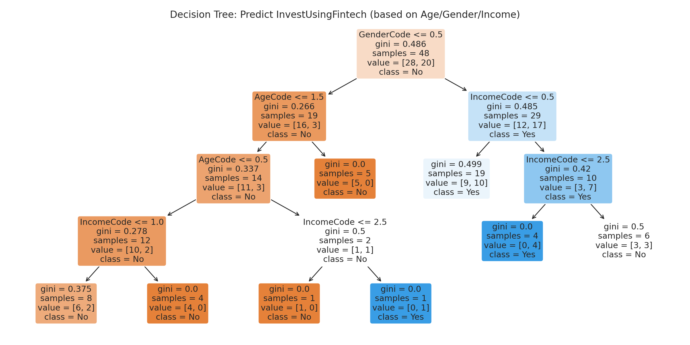
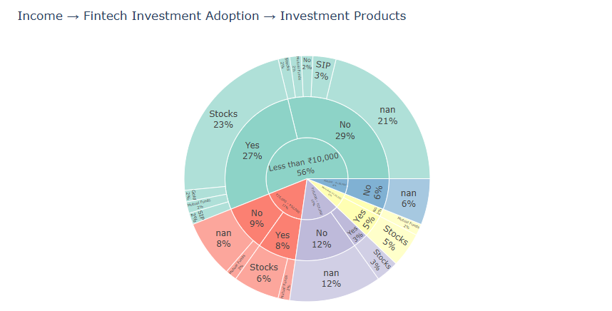

# FinTech Product Preferences Based on Demographic Analysis

## Overview
This project analyzes how demographic factors such as age, gender, occupation, education, and monthly income influence the adoption of FinTech products and digital payment platforms.

The analysis is based on responses collected through a structured Google Form survey and was performed using Python in Google Colab.

The project combines exploratory data analysis, statistical testing, and machine learning to identify trends in digital payment behaviour and investment preferences.

---

## Objectives
- Understand FinTech adoption across different demographic groups.
- Identify the most preferred digital payment applications.
- Study investment behaviour using FinTech platforms.
- Discover relationships between income, age, and investment preferences.
- Perform statistical testing to validate demographic relationships.
- Build a Decision Tree model for investment behaviour analysis.

---

## Dataset
Source:
Google Form Survey

The survey consists of four major sections:

- Demographic Information
- Digital Payment Behaviour
- Investment Behaviour
- Overall FinTech Preferences

The collected data was cleaned and transformed before analysis.

---

## Technologies Used
- Python
- Google Colab
- Pandas
- NumPy
- Matplotlib
- Seaborn
- Plotly
- Scikit-learn
- SciPy

---

## Analysis Performed

### Data Cleaning
- Removed unnecessary spaces
- Split multiple-choice responses
- Cleaned categorical variables

### Exploratory Data Analysis
- Top Payment Applications
- Payment Frequency
- Primary Payment Applications
- Investment Products
- Income Distribution
- FinTech Adoption

### Statistical Analysis
- Chi-Square Test
- Cross-tabulation Analysis

### Machine Learning
- Decision Tree Classification

---

## Visualizations

This repository includes:

- Top Payment Applications


- Age vs Primary Payment App Heatmap


- Payment Frequency


- Investment Product Distribution


- Income vs Investment Analysis


- Decision Tree Visualization


- Sunburst Chart

---

## Key Findings
- Younger respondents showed higher adoption of digital payment platforms.
- UPI-based payment applications were among the most frequently used.
- Monthly income influenced investment behaviour.
- Demographic variables showed meaningful relationships with FinTech adoption through Chi-Square testing.
- Decision Tree Classification demonstrated how demographic variables can help predict investment preferences.

---

## Repository Structure

```
FinTech-Product-Preferences-Demographic-Analysis/

│── Fintech_Product_Preferences_Analysis.ipynb
│── Fintech Survey Responses.csv
│── Cleaned_Fintech_Survey.csv
│── graphs/
│── README.md
```

---

## Future Improvements
- Increase survey size.
- Build an interactive Power BI dashboard.
- Deploy the project as a Streamlit application.
- Compare demographic trends across regions.

---

## Author
Dhruva Dagare
B.Sc. Data Science Graduate
Interested in Data Analytics, Business Intelligence, Machine Learning and Generative AI.
